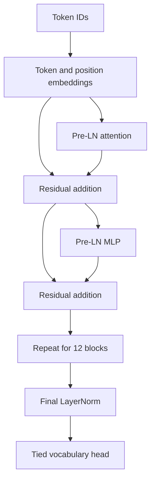

# PRIYAN LLM — 130M from scratch

A manually implemented PyTorch decoder-only Transformer with local BPE training, pretraining, supervised fine-tuning, evaluation, sampling, checkpoint resume, a CLI and a local FastAPI service. No hosted LLM API or pretrained backbone is used.

**This package is an engineering implementation, not a trained 130M assistant.** See `VALIDATION.md` for actual executed checks. The included tiny demonstration checkpoint is trained briefly on synthetic text solely to exercise the pipeline; it is not useful general language intelligence. Full-scale pretraining remains your work to run with suitable data and compute.

## Architecture and parameter count

| Component | Unique parameters |
|---|---:|
| Token + learned position embeddings | 39,383,808 |
| Attention | 28,348,416 |
| MLP | 62,276,160 |
| LayerNorm | 38,400 |
| LM head additional parameters | 0 (tied) |
| **Total / trainable** | **130,046,784** |

The specification's original 12-layer, width-768, MLP-3072, 50,257-vocabulary GPT-2 configuration is approximately 124M. This implementation increases MLP width to **3376**, keeping 12 layers, 12 heads and width 768, to reach 130,046,784. The counter enumerates actual unique parameter tensors on the meta device, without allocating 130M weights.



`model.py` contains attention, MLP, blocks and language-model composition together so the equations are easy to trace. The rest of the system is split into config, tokenizer, data, training, generation, API and CLI modules. This intentionally consolidates the many one-class files suggested in the input specification.

## Your Windows laptop

Your screenshot shows Ryzen 5 7235HS, 24 GB RAM, RTX 3050 Laptop GPU with 6 GB VRAM, and about 48 GB free disk space. Use **configs/laptop.yaml** for a first 130M experiment: microbatch 1, 256-token training windows, accumulation 8, checkpointing, automatic CUDA precision. This configuration is a memory-conscious starting point, **not a measured guarantee of fitting your GPU**.

The model supports 1024 positions. Laptop training uses only the first 256; do not assume longer contexts work well until those positions have been trained. `configs/130m.yaml` trains all 1024 positions and uses more memory. Reducing window length changes activation memory but not the count of model parameters.

FP32 weights alone use approximately 520 MB (decimal). Weights, gradients and two Adam moments use about 2.08 GB before activations, temporary tensors and CUDA overhead. An optimizer checkpoint is approximately 1.56 GB; atomic replacement temporarily needs room for old and new checkpoints. Installation, data and additional runs consume more disk space. Only `latest.pt` is retained in each run folder.

CPU is supported for correctness and tiny experiments. Larger RAM/VRAM permits larger experiments, but no speed or GPU-fit claims are made without measurement. Full pretraining is much more work than running the toy example.

## Install

Extract the archive and open PowerShell in `llm-130m`.

```powershell
py -3.11 -m venv .venv
```

Install **CUDA-enabled PyTorch >=2.4** using the [official PyTorch installation selector](https://pytorch.org/get-started/locally/). Select Windows, Pip, Python and a supported CUDA build. Replace the selector command's `pip3` with `.\.venv\Scripts\python.exe -m pip` so it installs into this environment. Then:

```powershell
.\.venv\Scripts\python.exe -m pip install -r requirements.txt
.\.venv\Scripts\python.exe -c "import torch; print(torch.__version__); print(torch.cuda.is_available())"
.\.venv\Scripts\python.exe scripts/count_parameters.py
.\.venv\Scripts\python.exe -m pytest -q
```

Use `.\.venv\Scripts\python.exe` in place of `python` in all commands below, or activate your environment. On Linux/macOS, create a venv with `python3 -m venv .venv` and use its Python. CUDA must report True for NVIDIA training. CPU/MPS use FP32; CUDA auto selects BF16 when supported, otherwise FP16 with GradScaler. An explicit fp32 mode disables autocast.

`requirements-tested.txt` records the authoring environment's direct dependency versions. It is a record, not a portable CUDA install command. Do not copy a CUDA wheel choice blindly across platforms.

## 1. Tiny pipeline first

The supplied synthetic sample has 300 distinct lines. It exists to verify the program, not to develop meaningful language ability.

```powershell
python -m llm train-tokenizer --input data/raw --output run-demo/tokenizer.json --vocab-size 512
python -m llm prepare-data --input data/raw --tokenizer run-demo/tokenizer.json --output run-demo/data
python -m llm train --config configs/tiny.yaml --tokenizer run-demo/tokenizer.json --data run-demo/data --output run-demo/checkpoints
python -m llm evaluate --checkpoint run-demo/checkpoints/latest.pt --data run-demo/data/validation.bin
python -m llm generate --checkpoint run-demo/checkpoints/latest.pt --prompt "Priyan learns" --max-new-tokens 40 --temperature 0.8 --top-k 50 --top-p 0.95
```

Use a new run name if a checkpoint already exists. Fresh training refuses to overwrite an existing checkpoint. Tests independently overfit a fixed tiny batch and check nonzero gradients, causal invariance, sampler constraints, API validation and exact CPU resume.

## 2. Data and tokenizer

TXT: each nonempty UTF-8 line is one document. JSONL: each row must contain `{"text":"..."}`. Multiple files are discovered recursively. Documents stream into uint32 little-endian memory-mapped token files with EOS boundaries. Random windows provide sampling with replacement; an epoch is not defined and checkpoints store epoch as null.

A seeded document-content hash selects train or validation. Identical document strings always go to the same split. This prevents exact duplicates from straddling splits; it does **not** remove duplicates or detect near-duplicates. Clean, normalize and deduplicate your corpus before use. Check the split sizes printed by preparation. Each distributed rank needs more than one full training window in each split.

BPE training should use **training-only text** for a strict held-out evaluation. For the convenience toy example only, the tokenizer sees all toy text. Never fit the tokenizer to held-out evaluation material when reporting research metrics. BPE training can learn fewer merges than requested on small data; its actual vocabulary is printed. Model vocabulary may be larger, but unused vocabulary IDs are masked during generation.

Use text you own, public-domain text or material whose license permits your use. Record source, license and consent. There are no automatic dataset downloads. Tamil and other Unicode text can be encoded, but language ability depends on corpus coverage and training. Dataset token count and parameter count are different quantities.

## 3. Small then full pretraining

`configs/small.yaml` provides an intermediate model with an 8192-token capacity. Train a separate tokenizer with `--vocab-size 8192` and prepare its own data. This is an independent model stage; the code does not transfer weights between differently sized architectures.

For 130M, place your prepared source documents in a separate folder, such as `my-corpus`, and tokenizer-training documents in `my-training-text`:

```powershell
python -m llm train-tokenizer --input my-training-text --output data/tokenizer/tokenizer.json --vocab-size 50257
python -m llm prepare-data --input my-corpus --tokenizer data/tokenizer/tokenizer.json --output data/processed
python -m llm train --config configs/laptop.yaml --tokenizer data/tokenizer/tokenizer.json --data data/processed --output checkpoints/first --stop-after 10
python -m llm train --config configs/laptop.yaml --tokenizer data/tokenizer/tokenizer.json --data data/processed --output checkpoints/first --resume
```

`max_steps` is the total schedule budget, not additional steps. `--stop-after` pauses after a bounded number of additional steps and saves a checkpoint. Resume requires unchanged configuration, world size, tokenizer and dataset metadata. It restores Python, NumPy, PyTorch, CUDA and data-sampling RNG state, optimizer, scaler and step. The deterministic LR schedule is reconstructed from config and step. Exact CPU equivalence is tested. GPU reproducibility can vary across hardware/software and nondeterministic kernels.

Microbatch × accumulation × sequence length × world size gives tokens per optimizer step. Gradient clipping is 1.0. AdamW excludes biases and LayerNorm vectors from weight decay. Logs report train loss, validation loss, perplexity, LR, gradient norm, elapsed time, throughput and CUDA peak allocated memory. JSONL logs require no tracking service. Throughput includes validation/save overhead between reported steps.

For a separate new fine-tuning run, initializing from a checkpoint deliberately resets optimizer/schedule; resume deliberately preserves them. Ctrl+C resumes from the last successfully written checkpoint, not the interrupted partial optimizer step.

## 4. Distributed execution

Linux example, with data prepared beforehand:

```bash
python -m torch.distributed.run --standalone --nproc_per_node=2 scripts/pretrain.py --config configs/130m.yaml --tokenizer data/tokenizer/tokenizer.json --data data/processed --output checkpoints/ddp
```

Each process receives a non-overlapping contiguous token region and rank-specific sampling seed. DDP accumulates without synchronizing until the final microbatch. Evaluation reduces token-weighted losses across ranks; only rank zero writes checkpoints and main logs. All rank RNG states are saved. NCCL is selected for CUDA, Gloo for CPU. Multi-GPU hardware validation is distinct from a two-process CPU smoke test. Errors during distributed setup can require terminating all workers and rerunning from a checkpoint.

## 5. Fine-tune on instructions

Create `sft/train.jsonl` and `sft/validation.jsonl` with disjoint examples:

```json
{"instruction":"Explain a variable simply.","input":"","output":"A variable is a name that refers to a value."}
```

Copy the pretraining config to a new config and adjust its **training** learning rate, total steps and warmup for your experiment. Keep the model configuration unchanged. For example, max_steps 200, warmup_steps 20, learning_rate 0.00003, min_lr 0.000003.

```powershell
python -m llm finetune --config configs/my-sft.yaml --tokenizer checkpoints/first/tokenizer.json --checkpoint checkpoints/first/latest.pt --instructions sft/train.jsonl --data sft --output checkpoints/sft
```

By default only response tokens and EOS contribute to the loss. `--all-tokens` also trains prompt tokens. Right-side padding targets are ignored. Examples longer than the configured sequence window are skipped rather than silently truncating an answer. The dataset errors if none remain. This SFT path loads usable examples into RAM, so use manageable files.

`--template path.txt` accepts a Python-format template containing `{instruction}` and `{input}`. Its suffix should cue the assistant response. Use the same rendered template for inference. A template is formatting, not proof the model follows instructions. LoRA is an optional future extension and is not implemented.

## 6. API and CLI

```powershell
python -m llm serve --checkpoint checkpoints/sft/latest.pt --port 8000
```

Open `http://127.0.0.1:8000/docs` locally. Endpoints:

| Endpoint | Request |
|---|---|
| GET /health | none |
| GET /model-info | none |
| POST /generate | prompt, max_new_tokens, temperature, top_k, top_p, repetition_penalty |
| POST /tokenize | text |
| POST /decode | ids |

Temperature 0 selects greedy decoding. EOS stops by default. Python generation additionally supports explicit stop token IDs. Generation recomputes the cropped context at each step; a KV cache is not implemented. The API caps input length and generation length, validates options and rejects concurrent generation with 429 to avoid unbounded queued GPU work.

The server binds to localhost. Authentication, TLS, request rate limiting and public deployment hardening are not included. Do not expose it as a production internet service as-is. No model/tool integration or external actions are enabled.

## 7. Export

```powershell
python -m llm export --checkpoint checkpoints/first/latest.pt --output exported-model
```

This saves `model.safetensors`, config JSON and tokenizer JSON. It is a package-specific export, **not** Hugging Face AutoModel-compatible. To load the exported weights:

```python
import json
from pathlib import Path
from safetensors.torch import load_file
from llm.config import Config
from llm.model import LanguageModel
from llm.tokenizer import BPETokenizer
p = Path('exported-model')
c = Config.from_dict(json.loads((p/'config.json').read_text()))
model = LanguageModel(c.model)
model.load_state_dict(load_file(str(p/'model.safetensors')))
model.eval()
tokenizer = BPETokenizer.load(p/'tokenizer.json')
```

Training checkpoints include optimizer and resume state; exports do not. Keep the tokenizer paired with its model.

## Mathematics and initialization

For each attention head, queries Q, keys K and values V are linear projections of normalized token representations. With head dimension d, attention is `softmax(QKᵀ / sqrt(d) + causal_mask)V`. The mask is negative infinity for future positions. Concatenated head outputs are projected back to model width. Both PyTorch SDPA and an explicit matrix/softmax fallback are implemented and compared in tests.

The feed-forward network is `GELU(xW1 + b1)W2 + b2`. Pre-LayerNorm and residual additions surround attention and the feed-forward network. The objective is the mean negative log probability of each next target token; ignored targets do not contribute. Perplexity is `exp(validation_loss)` using natural logarithms. Compare it only on the same tokenizer and evaluation corpus; toy perplexity is not a broad benchmark.

Linear and embedding weights use Normal(0, 0.02), biases zero, LayerNorm weights one. Attention and MLP residual-output weights use standard deviation `0.02/sqrt(2*layers)` to control residual growth. The output vocabulary projection reuses the input embedding tensor and adds zero unique parameters.

## Troubleshooting and boundaries

- CUDA False: check the driver and install the appropriate CUDA-enabled PyTorch wheel in your active environment.
- Out of memory: reduce batch or sequence length in a new run, enable checkpointing, close other GPU-heavy programs, or use tiny config. A changed config is deliberately not accepted by exact resume.
- Missing or tiny split: supply more distinct documents and rerun preparation; each rank must have a usable window.
- Tokenizer mismatch: use the tokenizer saved beside the checkpoint; do not retrain or replace it halfway through training.
- Nonfinite loss/gradients: training stops; inspect data, LR and precision. The last committed checkpoint remains intact.
- Nonsense output: expected from random weights and short synthetic training. More parameters alone do not give knowledge or instruction-following.
- Full corpus throughput is not measured; validation currently samples fixed seeded windows, not the entire held-out corpus.
- No deduplication tool, Parquet reader, TensorBoard/W&B adapter, LoRA, KV cache, Hugging Face export or public deployment hardening is included. These are optional extensions, not claimed features.

Any trained model can hallucinate, reflect biases, generate toxic text and expose memorized training data. Evaluate your actual corpus and intended task. Do not treat this educational model as factual authority. If later connected to tools, prompt injection and action authorization need separate controls.

## Source layout and license

`src/llm/`: configuration, tokenizer, data, manual model, training, generation, API, CLI. `configs/`: tiny/debug/small/130m/laptop. `scripts/`: command wrappers. `tests/`: correctness and integration checks. `notebooks/`: educational walkthroughs. `data/`: sample and input notes. `inference/`: alternative entry points. `VALIDATION.md`: measured evidence and untested scope.

Code is MIT licensed. Dataset rights are separate. Dependencies retain their own licenses.

Official references: [PyTorch AMP](https://docs.pytorch.org/docs/stable/amp.html), [PyTorch SDPA](https://docs.pytorch.org/docs/stable/generated/torch.nn.functional.scaled_dot_product_attention.html), [Hugging Face Tokenizers](https://huggingface.co/docs/tokenizers/).
"# LLM-130M-dataset" 
