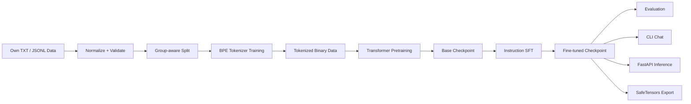
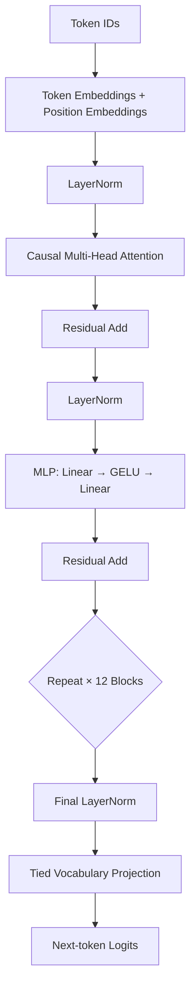

<div align="center">

# 🧠 PRIYAN LLM — 130M From Scratch


<br/>


**A complete educational language-model engineering pipeline built with PyTorch — from raw custom data to tokenizer training, pretraining, supervised fine-tuning, evaluation, text generation, CLI chat and local API inference.**

[Quick Start](#-quick-start) • [Architecture](#-model-architecture) • [Dataset](#-own-data-training-pipeline) • [Files](#-project-structure) • [Training](#-training) • [API](#-local-api) • [Validation](#-validation-status)

</div>

---

## ⚠️ Important Project Status

This repository contains a **real manually implemented ~130M parameter Transformer architecture and end-to-end training pipeline**.

It does **not** claim that the included demonstration checkpoint is already a useful 130M general assistant.

The starter dataset contains **72 synthetic multilingual examples** and exists mainly to validate the pipeline. A useful from-scratch language model requires a much larger, diverse, licensed and carefully reviewed corpus plus substantially more training compute.

> **Implemented model ≠ fully pretrained intelligent assistant.**
>
> The engineering pipeline is here. Full-scale training is the next major step.

---

## ✨ What This Repository Includes

- 🧠 Decoder-only Transformer implemented in PyTorch
- 🔢 **130,046,784 trainable parameters** in the full configuration
- 🧩 12 Transformer layers
- 🎯 12 attention heads
- 📐 768-dimensional model width
- ⚡ 3376-dimensional MLP hidden width
- 📚 50,257-token full model vocabulary capacity
- 🔗 Tied token embedding / LM output weights
- 🚧 Causal self-attention
- 🧮 GELU feed-forward network
- 🧱 Pre-LayerNorm residual Transformer blocks
- 📝 Local BPE tokenizer training
- 🗂️ TXT and JSONL dataset ingestion
- 🌍 English, Tamil and Thenglish-compatible Unicode pipeline
- 🧹 Dataset normalization and exact duplicate removal tools
- 🔐 Group-aware train / validation / test splitting
- 🚀 Pretraining
- 🎓 Response-only supervised fine-tuning (SFT)
- 📊 Validation loss and perplexity evaluation
- 🎲 Temperature, Top-K and Top-P sampling
- 💾 Atomic checkpoints and resume support
- 🖥️ CLI generation and chat tools
- 🌐 Local FastAPI inference service
- 📦 SafeTensors export
- 🧪 Unit and integration validation paths
- ⚙️ Tiny, debug, small, laptop and full 130M configurations

---

## 🔄 End-to-End System Flow



### Training lifecycle

```text
RAW DATA
   │
   ▼
CLEAN / NORMALIZE
   │
   ▼
TRAIN ───── VALIDATION ───── TEST
   │
   ▼
BPE TOKENIZER
   │
   ▼
TOKEN IDS
   │
   ▼
130M TRANSFORMER
   │
   ├── PRETRAIN
   │
   ├── SFT
   │
   ├── EVALUATE
   │
   └── GENERATE / CHAT / API
```

---

## 🧠 Model Architecture

| Component | Configuration |
|---|---:|
| Architecture | Decoder-only Transformer |
| Layers | 12 |
| Attention heads | 12 |
| Model width | 768 |
| MLP width | 3376 |
| Max positions | 1024 |
| Full vocab capacity | 50,257 |
| Activation | GELU |
| Normalization | Pre-LayerNorm |
| Attention | Causal self-attention |
| Output head | Tied with token embeddings |
| Total trainable parameters | **130,046,784** |

### Parameter breakdown

| Component | Unique parameters |
|---|---:|
| Token + learned position embeddings | 39,383,808 |
| Attention | 28,348,416 |
| MLP | 62,276,160 |
| LayerNorm | 38,400 |
| LM head additional parameters | 0 — tied weights |
| **Total** | **130,046,784** |



For each head, attention follows:

```text
Attention(Q, K, V) = softmax((QKᵀ / √d) + causal_mask)V
```

The objective is next-token prediction using cross-entropy loss.

---

## 🌍 Own Data Training Pipeline

The project can train using your own UTF-8 data instead of downloading a pretrained model.

### Supported raw formats

#### Plain text

Each non-empty line can act as a document.

```text
Python is a programming language.
ஒரு variable ஒரு value-ஐ refer செய்யும் பெயர்.
Machine learning learns patterns from data.
```

#### JSONL

```json
{"group_id":"variables-001","language":"en","source":"My notes","license":"User-owned","text":"A variable refers to a value.","instruction":"Explain a variable.","input":"","output":"A variable is a name that refers to a value."}
```

Use the same `group_id` for translations, paraphrases and related Q&A so related examples stay in the same split.

### Starter dataset

The included starter dataset contains:

- **72 synthetic examples**
- English examples
- Tamil examples
- Thenglish examples
- 24 concept groups × 3 language variants
- Group-aware split
- **60 train / 6 validation / 6 test** records

The starter corpus is deliberately small. It validates the workflow; it is not enough for useful general language intelligence.

---

## 📁 Project Structure

```text
LLM-130M-dataset/
│
├── README.md                    # Main project documentation
├── START_HERE.md                # Minimal starting guide
├── OWN_MODEL_GUIDE.md           # Own-data → training → replies guide
├── VALIDATION.md                # Core implementation validation notes
├── OWN_DATA_VALIDATION.md       # Own-data pipeline validation notes
├── FULL_MODEL_SMOKE.json        # Full-model smoke-test evidence
├── own-test-report.json         # Own-model evaluation output
├── LICENSE                      # MIT code license
├── .gitignore
│
├── configs/
│   ├── tiny.yaml                # Very small execution test
│   ├── debug.yaml               # Debug configuration
│   ├── small.yaml               # Intermediate model experiment
│   ├── laptop.yaml              # Memory-conscious laptop experiment
│   └── 130m.yaml                # Full 130M configuration
│
├── src/
│   └── llm/
│       ├── __init__.py
│       ├── __main__.py
│       ├── api.py               # FastAPI service
│       ├── cli.py               # Main command-line interface
│       ├── config.py            # Configuration loading / validation
│       ├── data.py              # Token data + sampling pipeline
│       ├── generation.py        # Text sampling / generation
│       ├── model.py             # Transformer implementation
│       ├── tokenizer.py         # BPE tokenizer utilities
│       └── training.py          # Training / evaluation / checkpoints
│
├── scripts/
│   ├── build_dataset.py         # Build clean own-data dataset
│   ├── train_own.py             # Pretrain + SFT own model
│   ├── chat_own.py              # Chat with own checkpoint
│   ├── evaluate_own.py          # Evaluate own-model checkpoint
│   ├── count_parameters.py      # Verify parameter count
│   ├── train_tokenizer.py       # Tokenizer wrapper
│   ├── prepare_data.py          # Data preparation wrapper
│   ├── pretrain.py              # Pretraining wrapper
│   ├── finetune.py              # SFT wrapper
│   ├── evaluate.py              # Evaluation wrapper
│   ├── generate.py              # Generation wrapper
│   └── export_model.py          # Model export wrapper
│
├── data/                        # Starter / raw / processed data assets
├── demo/                        # Demo utilities
├── inference/                   # Inference entry points
├── notebooks/                   # Educational walkthroughs
└── tests/                       # Correctness / integration tests
```

---

## 🗃️ Core Files Explained

| File | Purpose |
|---|---|
| `src/llm/model.py` | Attention, MLP, Transformer blocks and language model |
| `src/llm/training.py` | Optimizer, AMP, gradient accumulation, checkpoints, resume and evaluation |
| `src/llm/tokenizer.py` | Train/load local BPE tokenizer |
| `src/llm/data.py` | Dataset preparation and random token-window sampling |
| `src/llm/generation.py` | Greedy / temperature / Top-K / Top-P generation |
| `src/llm/api.py` | Local FastAPI inference endpoints |
| `src/llm/cli.py` | `python -m llm ...` command interface |
| `scripts/build_dataset.py` | Normalize records, deduplicate and create data splits |
| `scripts/train_own.py` | Run custom-data pretraining and SFT pipeline |
| `scripts/chat_own.py` | Interactive terminal chat with your checkpoint |
| `scripts/evaluate_own.py` | Held-out loss, perplexity and generated examples |
| `configs/laptop.yaml` | Lower-memory starting configuration |
| `configs/130m.yaml` | Full model training configuration |
| `OWN_MODEL_GUIDE.md` | Detailed own-data workflow |
| `VALIDATION.md` | What has actually been tested vs what remains untested |

---

## 🚀 Quick Start

### 1. Clone

```bash
git clone https://github.com/PRIYAN-A-1/LLM-130M-dataset.git
cd LLM-130M-dataset
```

### 2. Create environment

Windows:

```powershell
py -3.11 -m venv .venv
.\.venv\Scripts\python.exe -m pip install --upgrade pip
```

Install a suitable CUDA-enabled PyTorch build from the official PyTorch installation selector if you are using an NVIDIA GPU, then install project dependencies:

```powershell
.\.venv\Scripts\python.exe -m pip install -r requirements.txt
```

### 3. Check PyTorch / CUDA

```powershell
.\.venv\Scripts\python.exe -c "import torch; print(torch.__version__); print('CUDA:', torch.cuda.is_available())"
```

### 4. Verify parameter count

```powershell
.\.venv\Scripts\python.exe scripts/count_parameters.py
```

Expected full-model parameter count:

```text
130,046,784
```

### 5. Run tests

```powershell
.\.venv\Scripts\python.exe -m pytest -q
```

---

## 🧪 Tiny Pipeline Test

Start small before attempting the full model.

```powershell
python -m llm train-tokenizer --input data/raw --output run-demo/tokenizer.json --vocab-size 512
python -m llm prepare-data --input data/raw --tokenizer run-demo/tokenizer.json --output run-demo/data
python -m llm train --config configs/tiny.yaml --tokenizer run-demo/tokenizer.json --data run-demo/data --output run-demo/checkpoints
python -m llm evaluate --checkpoint run-demo/checkpoints/latest.pt --data run-demo/data/validation.bin
python -m llm generate --checkpoint run-demo/checkpoints/latest.pt --prompt "Priyan learns" --max-new-tokens 40 --temperature 0.8 --top-k 50 --top-p 0.95
```

The tiny run checks that data, tokenization, forward/backward passes, checkpointing and generation work together.

---

## 🛠️ Build a Dataset From Your Own Data

Place your JSONL / text files inside a folder such as `my-data/`.

```powershell
python scripts/build_dataset.py --input my-data --output data/ready-v2 --vocab-size 8192
```

For a large corpus targeting the current full architecture:

```powershell
python scripts/build_dataset.py --input my-data --output data/ready-full --vocab-size 50257
```

The builder performs:

```text
Unicode NFC normalization
        ↓
Line-ending normalization
        ↓
Whitespace cleanup
        ↓
Exact duplicate removal
        ↓
Related-group protection
        ↓
Train / Validation / Test split
        ↓
Training-only BPE fitting
        ↓
Tokenized data + metadata
```

Near-duplicate detection and automatic truth checking are not implemented; dataset quality still requires human review.

---

## 🏋️ Training

### Tiny own-data training trial

```powershell
python scripts/train_own.py --stage tiny --data data/ready-v1 --output own-runs/my-tiny --steps 20 --sft-steps 10
```

### Chat with the resulting checkpoint

```powershell
python scripts/chat_own.py --checkpoint own-runs/my-tiny/sft/latest.pt
```

### Evaluate

```powershell
python scripts/evaluate_own.py --checkpoint own-runs/my-tiny/sft/latest.pt --test data/ready-v1/sft/test.jsonl --output my-test-report.json
```

### Short full 130M hardware smoke trial

```powershell
python scripts/train_own.py --stage 130m --data data/ready-v1 --output own-runs/my-130m-trial --steps 2 --sft-steps 2
```

This is only a hardware/pipeline trial. Two training steps do not produce a useful assistant.

### Full pretraining path

```powershell
python -m llm train-tokenizer --input my-training-text --output data/tokenizer/tokenizer.json --vocab-size 50257
python -m llm prepare-data --input my-corpus --tokenizer data/tokenizer/tokenizer.json --output data/processed
python -m llm train --config configs/laptop.yaml --tokenizer data/tokenizer/tokenizer.json --data data/processed --output checkpoints/first --stop-after 10
```

Resume:

```powershell
python -m llm train --config configs/laptop.yaml --tokenizer data/tokenizer/tokenizer.json --data data/processed --output checkpoints/first --resume
```

---

## 🎓 Supervised Fine-Tuning

Instruction data format:

```json
{"instruction":"Explain a variable simply.","input":"","output":"A variable is a name that refers to a value."}
```

Run SFT:

```powershell
python -m llm finetune --config configs/my-sft.yaml --tokenizer checkpoints/first/tokenizer.json --checkpoint checkpoints/first/latest.pt --instructions sft/train.jsonl --data sft --output checkpoints/sft
```

By default, only response tokens and EOS contribute to the SFT loss.

---

## 💬 Generation

```powershell
python -m llm generate --checkpoint checkpoints/sft/latest.pt --prompt "Explain machine learning" --max-new-tokens 100 --temperature 0.8 --top-k 50 --top-p 0.95
```

Generation supports:

- Greedy decoding with temperature `0`
- Temperature sampling
- Top-K filtering
- Top-P / nucleus sampling
- Repetition penalty
- EOS stopping

A KV cache is not currently implemented, so generation recomputes the cropped context each step.

---

## 🌐 Local API

Start the local FastAPI server:

```powershell
python -m llm serve --checkpoint checkpoints/sft/latest.pt --port 8000
```

Open locally:

```text
http://127.0.0.1:8000/docs
```

### Endpoints

| Method | Endpoint | Purpose |
|---|---|---|
| `GET` | `/health` | Service health |
| `GET` | `/model-info` | Model metadata |
| `POST` | `/generate` | Generate text |
| `POST` | `/tokenize` | Convert text to token IDs |
| `POST` | `/decode` | Convert IDs back to text |

The server is intended for local development. Authentication, TLS and production deployment hardening are not included.

---

## 📦 Export

```powershell
python -m llm export --checkpoint checkpoints/first/latest.pt --output exported-model
```

Output includes:

```text
exported-model/
├── model.safetensors
├── config.json
└── tokenizer.json
```

The export is package-specific and is not automatically Hugging Face `AutoModel` compatible.

---

## 💻 Laptop Configuration

`configs/laptop.yaml` is intended as a memory-conscious starting point for limited GPU hardware.

Typical ideas used in the laptop configuration include:

- Microbatch size 1
- Shorter training windows
- Gradient accumulation
- Activation checkpointing
- Automatic CUDA precision

Reducing sequence length reduces activation memory but does **not** reduce the number of model parameters.

Hardware fit and training speed should be measured on the actual machine rather than assumed.

---

## 📊 Validation Status

This repository separates **implemented features** from **measured evidence**.

Read:

- [`VALIDATION.md`](VALIDATION.md) — implementation tests and boundaries
- [`OWN_DATA_VALIDATION.md`](OWN_DATA_VALIDATION.md) — own-data pipeline checks
- [`OWN_MODEL_GUIDE.md`](OWN_MODEL_GUIDE.md) — custom-data training guide
- [`FULL_MODEL_SMOKE.json`](FULL_MODEL_SMOKE.json) — full-model smoke evidence
- [`own-test-report.json`](own-test-report.json) — starter own-model evaluation output

Examples of validation paths include:

- Parameter counting
- Tiny-batch overfit tests
- Gradient checks
- Causal invariance checks
- Sampling constraints
- API input validation
- CPU checkpoint/resume equivalence
- Real loss calculations
- Saved checkpoint loading

Full 130M pretraining on a substantive corpus and large-scale multilingual quality evaluation remain future work.

---

## 🔬 Training Notes

Effective tokens per optimizer step are approximately:

```text
microbatch × accumulation × sequence_length × world_size
```

Training supports:

- AdamW
- Gradient clipping
- Automatic mixed precision on CUDA
- Gradient accumulation
- Checkpoint resume
- Learning-rate scheduling
- Validation loss
- Perplexity
- Throughput logging
- CUDA peak-memory logging
- Distributed Data Parallel execution

Linux multi-GPU example:

```bash
python -m torch.distributed.run --standalone --nproc_per_node=2 scripts/pretrain.py \
  --config configs/130m.yaml \
  --tokenizer data/tokenizer/tokenizer.json \
  --data data/processed \
  --output checkpoints/ddp
```

---

## 🗺️ Roadmap

Potential future improvements:

- [ ] Train on a substantially larger licensed multilingual corpus
- [ ] Add stronger dataset quality filtering
- [ ] Add near-duplicate detection
- [ ] Add benchmark suites
- [ ] Add KV-cache generation
- [ ] Add LoRA / PEFT support
- [ ] Add TensorBoard or W&B integration
- [ ] Add Hugging Face-compatible export
- [ ] Add quantized inference
- [ ] Improve Tamil / Thenglish evaluation
- [ ] Add safer production API deployment patterns
- [ ] Publish reproducible long-run training metrics

---

## 🛡️ Responsible Use

A trained language model can hallucinate, reproduce dataset bias, generate unsafe content or memorize portions of its training data.

Before using custom data:

1. Confirm you have permission to use it.
2. Remove private or sensitive information.
3. Record dataset source and license.
4. Keep test data isolated from training.
5. Evaluate outputs on the actual intended task.
6. Do not treat generated text as guaranteed factual information.

---

## 📜 License

The project code is released under the **MIT License**.

Dataset rights are separate. Any data you add keeps its original copyright, license and usage restrictions.

---

## 📚 References

- [PyTorch](https://pytorch.org/)
- [PyTorch Automatic Mixed Precision](https://docs.pytorch.org/docs/stable/amp.html)
- [PyTorch Scaled Dot Product Attention](https://docs.pytorch.org/docs/stable/generated/torch.nn.functional.scaled_dot_product_attention.html)
- [Hugging Face Tokenizers](https://huggingface.co/docs/tokenizers/)
- [FastAPI](https://fastapi.tiangolo.com/)

---

<div align="center">

### 🚀 Built to learn the complete LLM pipeline — not just call an API.


**Created by [PRIYAN-A-1](https://github.com/PRIYAN-A-1)**

⭐ If this project helps you understand LLM engineering, consider starring the repository.

</div>
